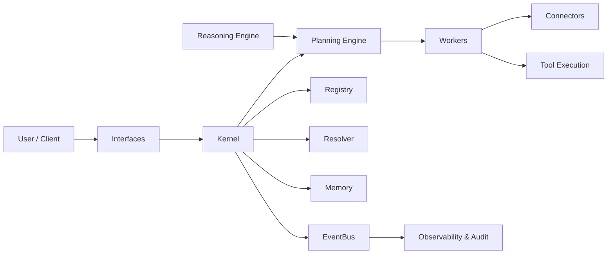
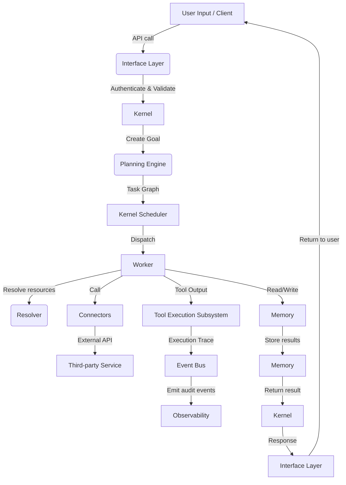

# Architecture — LAB AI OS

This document describes the high-level architecture of LAB AI OS, a modular operating system for autonomous AI agents. It provides an overview of system components, their responsibilities, and the data flow between them. The document follows enterprise software documentation standards and includes diagrams that illustrate system structure and request flows.

---

## System Overview

LAB AI OS is designed as a modular platform that composes well-defined subsystems to provide safe, auditable, and extensible runtime services for intelligent agents. Key design goals include modularity, security, observability, and extensibility.

Top-level components:

- Kernel
- Memory
- Registry
- Resolver
- Workers
- Interfaces
- Connectors
- Planning Engine
- Reasoning Engine
- Tool Execution
- Event Bus

Mermaid diagram (high level):

---

## Kernel

The Kernel is the core orchestration and runtime manager. Responsibilities:

- Agent lifecycle management (create/start/pause/stop)
- Capability and policy enforcement
- Task scheduling and assignment
- Central configuration and coordination
- Event bus management and observability hooks

The kernel exposes a stable API surface for Interfaces and programmatic control. It performs leader election and clustering duties in distributed deployments.

---

## Memory

Memory is the persistent, versioned store for agent state, observations, and artifacts. It is designed for privacy-first operation and supports:

- Structured records and semantic indexes
- Namespaces and access control for per-agent scoping
- Provenance metadata for each write (origin, timestamp, confidence)
- Retention and lifecycle policies

Memory implementations are pluggable (file, RDBMS, vector DB) behind a clear interface.

---

## Registry

The Registry is the service and capability directory. It holds metadata about available connectors, workers, agents, and published skills. Registry responsibilities:

- Service discovery and capability advertisement
- Version and compatibility metadata
- Health and heartbeat monitoring for registered components

---

## Resolver

The Resolver translates logical resource identifiers into concrete endpoints and credentials. It handles:

- Secrets resolution via secure backends
- Mapping logical connectors to provider endpoints
- Applying policy-based routing and prioritized fallbacks

Resolvers are pluggable and may consult external secret stores or vaults.

---

## Workers

Workers perform isolated execution of tasks and tools. Characteristics:

- Sandboxed runtime (process, container, VM) with capability scoping
- Resource limits (CPU, memory, disk, network)
- Short-lived and long-lived worker types
- Execution tracing, logging, and exit status capture

Workers register with the Registry and subscribe to task queues propagated by the Kernel.

---

## Interfaces

Interfaces provide external access to LAB AI OS. They include:

- CLI and SDKs (developer-facing)
- HTTP/REST and gRPC APIs (service integration)
- Web and GUI components for human-in-the-loop interactions

Interfaces implement authentication, authorization, and input validation and translate external requests into kernel actions.

---

## Connectors

Connectors adapt external systems into the LAB AI OS ecosystem. Examples:

- LLM providers (Claude, OpenAI)
- File systems and cloud storage
- Databases, message queues, and enterprise systems
- Monitoring and analytics platforms

Connectors implement a consistent adapter interface and are registered with the Registry for discovery.

---

## Planning Engine

The Planning Engine converts high-level goals into actionable workflows. Responsibilities:

- Goal decomposition into DAGs of tasks
- Dependency resolution and task prioritization
- Integration points for the Reasoning Engine to validate or refine plans

Planning outputs are canonical task graphs consumed by the Kernel to schedule work to Workers.

---

## Reasoning Engine

The Reasoning Engine provides higher-order inference, verification, and validation capabilities. Typical responsibilities:

- Evaluate trade-offs and constraints for plans
- Verify assumptions against memory and external facts
- Produce explanations, confidence scores, and counterfactual checks

Reasoning modules can be composed from multiple engines (symbolic, probabilistic, neural) and are designed to be replaceable.

---

## Tool Execution

Tool Execution is the subsystem that manages invocation of external tools and APIs. It ensures:

- Capability-scoped access tokens and least-privilege execution
- Execution sandboxing with constraints and timeouts
- Secure input/output marshalling and logging

Tool Execution runs inside Workers and reports structured execution traces back to the Event Bus and Memory when needed.

---

## Event Bus

The Event Bus is the central message backbone for asynchronous communication. It supports:

- Publish/subscribe semantics for lifecycle events, task events, and telemetry
- Durable message semantics for critical workflow steps
- Integration with observability pipelines (metrics, logs, traces)

The Event Bus enables loose coupling and extensibility across modules.

---

## Data Flow

This section explains the typical flow of a user request through the system.

Mermaid flow diagram:

Detailed request lifecycle:

1. User submits a request through an Interface (CLI, REST, SDK, UI). The Interface authenticates the caller and validates the input.
2. The Interface issues a request to the Kernel to treat the input as a Goal. The Kernel creates an agent context and consults policy configuration.
3. The Kernel invokes the Planning Engine to decompose the goal into a task graph. The Reasoning Engine may be consulted to validate constraints or propose subgoals.
4. The Kernel Scheduler takes the task graph and enqueues tasks. Tasks are annotated with required capabilities and resource constraints.
5. Workers pick up tasks matching capabilities from the Registry/Task Queue. A Worker uses the Resolver to obtain concrete endpoints and credentials.
6. Workers interact with Memory for context and persistent data. When external actions are needed, Workers call Connectors.
7. Tool Execution is performed in the Worker environment; the Activity is traced and emitted to the Event Bus.
8. Execution results and provenance are stored in Memory and relevant events emitted to Observability systems.
9. The Kernel aggregates task outcomes, applies any final reasoning or verification, and produces a response object.
10. The Interface returns the response to the user and stores decision records for auditability.

---

## Component Integration and Extensibility

All components expose versioned interfaces and clear contracts. The Registry and Event Bus are the primary extension points to add new Connectors, Workers, and reasoning modules. Modules must provide metadata, health checks, and compatibility declarations.

---

## Operational Considerations

- Observability: Instrument all kernel and worker operations to generate metrics, logs, and traces.
- Security: Enforce least privilege and isolate execution paths for tools and connectors.
- Backups & Durability: Ensure memory backends have backups and documented restore procedures.
- Upgrades: Support rolling upgrades with version compatibility checks in the Registry.

---

For detailed component-level APIs and message schemas, consult the `interfaces/` and `kernel/` subdirectories and the code-level documentation.